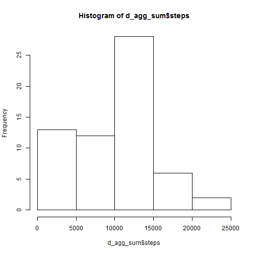
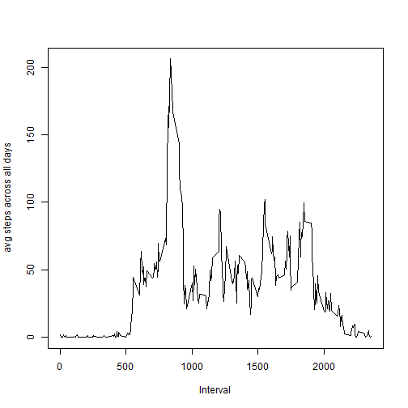
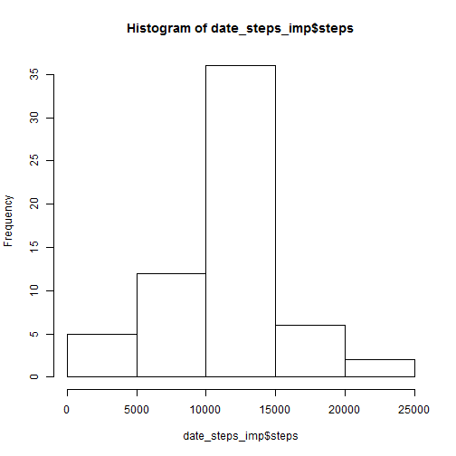

## Loading and preprocessing the data

```r
d <- read.csv("activity.csv",header=TRUE,colClasses=c("integer","Date","integer"))
d["i_factor"] = as.factor(d$interval)
d$wd = weekdays(d$date)
d$weekend = "weekday"
d$weekend[(d$wd == "Sonntag") | (d$wd=="Samstag")] = "weekend"
d$weekend = as.factor(d$weekend)
d_agg_sum <- aggregate(d[1],list(d$date),FUN=sum, na.rm=TRUE)
```

## What is mean total number of steps taken per day?
You'll find the total number of steps taken per day in the following table.


```r
library(xtable)
```

```
## Warning: package 'xtable' was built under R version 3.1.3
```

```r
xt <- xtable(d_agg_sum)
print(xt, type="html")
```

```
## Warning in formatC(x = structure(c(15614, 15615, 15616, 15617, 15618,
## 15619, : class of 'x' was discarded
```

<!-- html table generated in R 3.1.2 by xtable 1.7-4 package -->
<!-- Sun May 17 22:03:32 2015 -->
<table border=1>
<tr> <th>  </th> <th> Group.1 </th> <th> steps </th>  </tr>
  <tr> <td align="right"> 1 </td> <td align="right"> 15614.00 </td> <td align="right">   0 </td> </tr>
  <tr> <td align="right"> 2 </td> <td align="right"> 15615.00 </td> <td align="right"> 126 </td> </tr>
  <tr> <td align="right"> 3 </td> <td align="right"> 15616.00 </td> <td align="right"> 11352 </td> </tr>
  <tr> <td align="right"> 4 </td> <td align="right"> 15617.00 </td> <td align="right"> 12116 </td> </tr>
  <tr> <td align="right"> 5 </td> <td align="right"> 15618.00 </td> <td align="right"> 13294 </td> </tr>
  <tr> <td align="right"> 6 </td> <td align="right"> 15619.00 </td> <td align="right"> 15420 </td> </tr>
  <tr> <td align="right"> 7 </td> <td align="right"> 15620.00 </td> <td align="right"> 11015 </td> </tr>
  <tr> <td align="right"> 8 </td> <td align="right"> 15621.00 </td> <td align="right">   0 </td> </tr>
  <tr> <td align="right"> 9 </td> <td align="right"> 15622.00 </td> <td align="right"> 12811 </td> </tr>
  <tr> <td align="right"> 10 </td> <td align="right"> 15623.00 </td> <td align="right"> 9900 </td> </tr>
  <tr> <td align="right"> 11 </td> <td align="right"> 15624.00 </td> <td align="right"> 10304 </td> </tr>
  <tr> <td align="right"> 12 </td> <td align="right"> 15625.00 </td> <td align="right"> 17382 </td> </tr>
  <tr> <td align="right"> 13 </td> <td align="right"> 15626.00 </td> <td align="right"> 12426 </td> </tr>
  <tr> <td align="right"> 14 </td> <td align="right"> 15627.00 </td> <td align="right"> 15098 </td> </tr>
  <tr> <td align="right"> 15 </td> <td align="right"> 15628.00 </td> <td align="right"> 10139 </td> </tr>
  <tr> <td align="right"> 16 </td> <td align="right"> 15629.00 </td> <td align="right"> 15084 </td> </tr>
  <tr> <td align="right"> 17 </td> <td align="right"> 15630.00 </td> <td align="right"> 13452 </td> </tr>
  <tr> <td align="right"> 18 </td> <td align="right"> 15631.00 </td> <td align="right"> 10056 </td> </tr>
  <tr> <td align="right"> 19 </td> <td align="right"> 15632.00 </td> <td align="right"> 11829 </td> </tr>
  <tr> <td align="right"> 20 </td> <td align="right"> 15633.00 </td> <td align="right"> 10395 </td> </tr>
  <tr> <td align="right"> 21 </td> <td align="right"> 15634.00 </td> <td align="right"> 8821 </td> </tr>
  <tr> <td align="right"> 22 </td> <td align="right"> 15635.00 </td> <td align="right"> 13460 </td> </tr>
  <tr> <td align="right"> 23 </td> <td align="right"> 15636.00 </td> <td align="right"> 8918 </td> </tr>
  <tr> <td align="right"> 24 </td> <td align="right"> 15637.00 </td> <td align="right"> 8355 </td> </tr>
  <tr> <td align="right"> 25 </td> <td align="right"> 15638.00 </td> <td align="right"> 2492 </td> </tr>
  <tr> <td align="right"> 26 </td> <td align="right"> 15639.00 </td> <td align="right"> 6778 </td> </tr>
  <tr> <td align="right"> 27 </td> <td align="right"> 15640.00 </td> <td align="right"> 10119 </td> </tr>
  <tr> <td align="right"> 28 </td> <td align="right"> 15641.00 </td> <td align="right"> 11458 </td> </tr>
  <tr> <td align="right"> 29 </td> <td align="right"> 15642.00 </td> <td align="right"> 5018 </td> </tr>
  <tr> <td align="right"> 30 </td> <td align="right"> 15643.00 </td> <td align="right"> 9819 </td> </tr>
  <tr> <td align="right"> 31 </td> <td align="right"> 15644.00 </td> <td align="right"> 15414 </td> </tr>
  <tr> <td align="right"> 32 </td> <td align="right"> 15645.00 </td> <td align="right">   0 </td> </tr>
  <tr> <td align="right"> 33 </td> <td align="right"> 15646.00 </td> <td align="right"> 10600 </td> </tr>
  <tr> <td align="right"> 34 </td> <td align="right"> 15647.00 </td> <td align="right"> 10571 </td> </tr>
  <tr> <td align="right"> 35 </td> <td align="right"> 15648.00 </td> <td align="right">   0 </td> </tr>
  <tr> <td align="right"> 36 </td> <td align="right"> 15649.00 </td> <td align="right"> 10439 </td> </tr>
  <tr> <td align="right"> 37 </td> <td align="right"> 15650.00 </td> <td align="right"> 8334 </td> </tr>
  <tr> <td align="right"> 38 </td> <td align="right"> 15651.00 </td> <td align="right"> 12883 </td> </tr>
  <tr> <td align="right"> 39 </td> <td align="right"> 15652.00 </td> <td align="right"> 3219 </td> </tr>
  <tr> <td align="right"> 40 </td> <td align="right"> 15653.00 </td> <td align="right">   0 </td> </tr>
  <tr> <td align="right"> 41 </td> <td align="right"> 15654.00 </td> <td align="right">   0 </td> </tr>
  <tr> <td align="right"> 42 </td> <td align="right"> 15655.00 </td> <td align="right"> 12608 </td> </tr>
  <tr> <td align="right"> 43 </td> <td align="right"> 15656.00 </td> <td align="right"> 10765 </td> </tr>
  <tr> <td align="right"> 44 </td> <td align="right"> 15657.00 </td> <td align="right"> 7336 </td> </tr>
  <tr> <td align="right"> 45 </td> <td align="right"> 15658.00 </td> <td align="right">   0 </td> </tr>
  <tr> <td align="right"> 46 </td> <td align="right"> 15659.00 </td> <td align="right">  41 </td> </tr>
  <tr> <td align="right"> 47 </td> <td align="right"> 15660.00 </td> <td align="right"> 5441 </td> </tr>
  <tr> <td align="right"> 48 </td> <td align="right"> 15661.00 </td> <td align="right"> 14339 </td> </tr>
  <tr> <td align="right"> 49 </td> <td align="right"> 15662.00 </td> <td align="right"> 15110 </td> </tr>
  <tr> <td align="right"> 50 </td> <td align="right"> 15663.00 </td> <td align="right"> 8841 </td> </tr>
  <tr> <td align="right"> 51 </td> <td align="right"> 15664.00 </td> <td align="right"> 4472 </td> </tr>
  <tr> <td align="right"> 52 </td> <td align="right"> 15665.00 </td> <td align="right"> 12787 </td> </tr>
  <tr> <td align="right"> 53 </td> <td align="right"> 15666.00 </td> <td align="right"> 20427 </td> </tr>
  <tr> <td align="right"> 54 </td> <td align="right"> 15667.00 </td> <td align="right"> 21194 </td> </tr>
  <tr> <td align="right"> 55 </td> <td align="right"> 15668.00 </td> <td align="right"> 14478 </td> </tr>
  <tr> <td align="right"> 56 </td> <td align="right"> 15669.00 </td> <td align="right"> 11834 </td> </tr>
  <tr> <td align="right"> 57 </td> <td align="right"> 15670.00 </td> <td align="right"> 11162 </td> </tr>
  <tr> <td align="right"> 58 </td> <td align="right"> 15671.00 </td> <td align="right"> 13646 </td> </tr>
  <tr> <td align="right"> 59 </td> <td align="right"> 15672.00 </td> <td align="right"> 10183 </td> </tr>
  <tr> <td align="right"> 60 </td> <td align="right"> 15673.00 </td> <td align="right"> 7047 </td> </tr>
  <tr> <td align="right"> 61 </td> <td align="right"> 15674.00 </td> <td align="right">   0 </td> </tr>
   </table>

A histogram of the total number of steps taken each day:

```r
hist(d_agg_sum$steps)
```

 

The mean of the total number of steps taken per day is 9354.2295082.

The median of the total number of steps taken per day is 10395.

## What is the average daily activity pattern?


```r
ts <- aggregate(d$steps,list(d$interval),FUN=mean,na.rm=TRUE)
plot(ts,type='l',xlab = "Interval",ylab = "avg steps across all days")
```

 

Interval 835 contains the maximum average.


## Imputing missing values

There are 2304 rows containing missing values.

The missing values are filled with the mean value of that interval across all days in the dataset.


```r
for (i in 1:nrow(d)) {
  if (is.na(d$steps[i])) {
    # interval id
    iv <- d$interval[i]
    
    # mean for this interval
    steps_mean <- ts[ts[1]==iv]
    
    d$steps[i]<-steps_mean[2]
  }
}
```

A histogram of the total number of steps taken each day:


```r
#date_steps_imp <- aggregate(steps ~ date, d, sum)
date_steps_imp <- aggregate(d[1],list(d$date),FUN=sum)
hist(date_steps_imp$steps)
```

 

Mean:

```r
# Mean of steps per day imputed
mean(date_steps_imp$steps)
```

```
## [1] 10766.19
```

```r
# Mean of steps per day (w/ NA)
mean(d_agg_sum$steps)
```

```
## [1] 9354.23
```
The mean is raised by ~1500 steps

Median:

```r
# Median of steps per day imputed
median(date_steps_imp$steps)
```

```
## [1] 10766.19
```

```r
# Median of steps per day (w/ NA)
median(d_agg_sum$steps)
```

```
## [1] 10395
```
Median is raised.


## Are there differences in activity patterns between weekdays and weekends?


```r
ts_imputed <- aggregate(steps ~ interval+weekend, d, mean)

# make the panel plot for weekdays and weekends
library(ggplot2)

qplot(interval, steps, data=ts_imputed, geom=c("line"), xlab="Interval", 
      ylab="Number of steps", main="") + facet_wrap(~ weekend, ncol=1)
```

 
